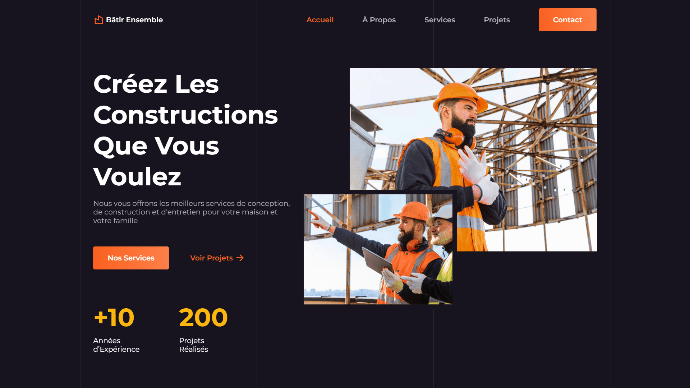

<div align="center">
    <a href="https://construction-company-vm.netlify.app/" target="_blank">
      
    </a>
    </br>
    </br>
  <h3 align="center">🏗️ Bâtir Ensemble &nbsp; — &nbsp; Entreprise de Construction</h3>
</div>

## <br /> 📌 Sommaire

&nbsp;&nbsp;&nbsp; 🎨 &nbsp; [**Introduction**](#introduction)<br />
&nbsp;&nbsp;&nbsp; 🛠️ &nbsp; [**Technologies**](#technologies)<br />
&nbsp;&nbsp;&nbsp; 🎯 &nbsp; [**Fonctionnalités**](#fonctionnalités)<br />
&nbsp;&nbsp;&nbsp; 🚀 &nbsp; [**Installation**](#installation)<br />

## <br /> <a name="introduction">🎨 Introduction</a>

Bâtir Ensemble est une landing page moderne et responsive pour une entreprise du bâtiment. Elle présente services, réalisations, témoignages et contact, avec animations au scroll via ScrollReveal et slider interactif via Swiper.js, le tout dans un design clair et modulaire pour une image professionnelle et engageante.

## <br /> <a name="technologies">🛠️ Technologies</a>

- HTML5 sémantique et structuration claire
- CSS3 moderne avec variables, media queries et animations
- JavaScript ES6 clair et modulaire
- [Swiper.js](https://swiperjs.com/) pour le carrousel des services
- [ScrollReveal](https://scrollrevealjs.org/) pour des animations au scroll
- [Remix Icons](https://remixicon.com/) pour des icônes vectorielles modernes
- Responsive Design pensé en mobile-first

## <br /> <a name="fonctionnalités">🎯 Fonctionnalités</a>

- Section d’accueil avec slogan animé et visuel double
- Section À propos avec liste des engagements & images croisées
- Carrousel interactif des différents services
- Section projets réalisés avec date, description et visuel
- Section Contact avec carte, réseaux sociaux et infos utiles
- Bouton ScrollUp animé et header sticky dynamique
- Animation ScrollReveal sur toutes les sections
- Footer complet avec navigation, horaires et réseaux

## <br /> <a name="installation">🚀 Installation</a>

### ✅ Prérequis

- [Google Chrome](https://www.google.com/) &nbsp;—&nbsp; Navigateur moderne
- [Visual Studio Code](https://code.visualstudio.com/) &nbsp;—&nbsp; Éditeur de code
- [Live Server](https://marketplace.visualstudio.com/items?itemName=ritwickdey.LiveServer) &nbsp;—&nbsp; Extension VS Code

### 📥 Cloner le projet

```bash
git clone git@github.com:ValentinMadiot/construction-company_ui
cd construction-company_ui
```

### ▶️ Lancer le projet

Il suffit d’ouvrir le fichier `index.html` dans un navigateur, ou d’utiliser l’extension **Live Server** sur VS Code pour un aperçu dynamique.
